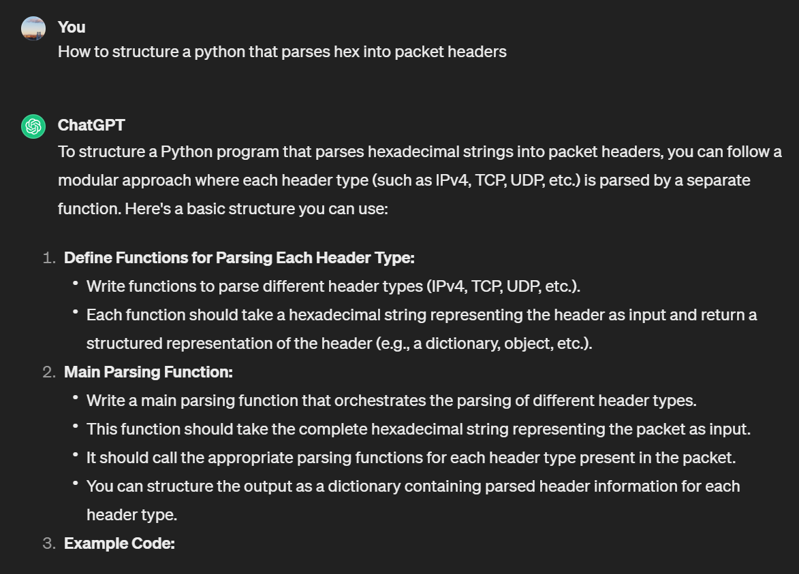

# CSCI 351: Programming Assignment 1
> Derek Garcia

## Usage
```bash
python3 main.py <path to packet file>
```

## References
- Process the Ethernet header fields: https://www.geeksforgeeks.org/ethernet-frame-format/
- Process the IP header fields: https://www.rfc-editor.org/rfc/rfc791#page-11
- Process the TCP header fields: https://www.rfc-editor.org/rfc/rfc9293#name-header-format
- Converting to Hex:
  - https://www.geeksforgeeks.org/python-ways-to-convert-hex-into-binary/
  - https://www.javatpoint.com/how-to-convert-hexadecimal-to-binary-in-python
- Checksum Calculation:
  - https://www.youtube.com/watch?v=7LniwyiH0SM
  - https://www.thegeekstuff.com/2012/05/ip-header-checksum/

## Extra Credit


I asked ChatGPT 3.5 how I should structure a program that converts hex into packet information. Since there is well
established documentation on how to parse hex data to get packet info, I wanted to ask a more abstract architecture 
question. ChatGPT recommended writing specific parsing methods to handle each section of hex. I implemented something 
similar, but instead of functions, I wrote classes to parse the data in chunks and pass it down to the next header.